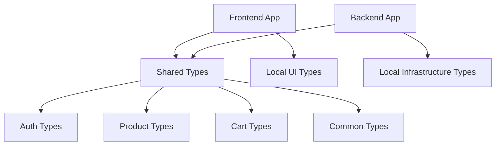

# 🚀 Web Ecom - Monorepo

E-commerce application với **NestJS backend** và **React frontend** sử dụng **pnpm workspaces** để chia sẻ types.

## 📁 **Cấu trúc Project**

```
Web-Ecom/
├── apps/
│   ├── frontend/         # React app (Vite + TypeScript)
│   └── backend/          # NestJS app (TypeScript)
├── packages/
│   └── shared-types/     # Shared DTOs, interfaces, enums
├── package.json          # Root workspace config
└── pnpm-workspace.yaml   # Workspace definition
```

## 🧰 **Requirements**

- **Node.js** >= 18.0.0
- **pnpm** >= 8.0.0

## 🏃‍♂️ **Quick Start**

### 1. Install dependencies

```bash
pnpm install
```

### 2. Chạy development servers

**Chạy cả frontend và backend cùng lúc:**

```bash
pnpm dev
```

**Hoặc chạy riêng lẻ:**

```bash
# Chỉ frontend
pnpm frontend:dev

# Chỉ backend
pnpm backend:dev
```

### 3. Build production

```bash
pnpm build
```

## 📦 **Available Scripts**

| Command               | Mô tả                     |
| --------------------- | ------------------------- |
| `pnpm dev`            | Chạy cả FE và BE cùng lúc |
| `pnpm build`          | Build tất cả packages     |
| `pnpm lint`           | Lint code cho cả FE và BE |
| `pnpm test`           | Chạy tests                |
| `pnpm frontend:dev`   | Chỉ chạy frontend         |
| `pnpm backend:dev`    | Chỉ chạy backend          |
| `pnpm frontend:build` | Build frontend            |
| `pnpm backend:build`  | Build backend             |

## 🔗 **Shared Types Usage**

**Import shared types từ bất kỳ app nào:**

```typescript
// Trong frontend hoặc backend
import {
  User,
  LoginUserDto,
  Product,
  AddToCartDto,
  UserRole,
  SortOrder,
} from "@web-ecom/shared-types";
```

**Package `@web-ecom/shared-types` bao gồm:**

- **Auth types**: `User`, `LoginUserDto`, `RegisterUserDto`, `JwtPayload`...
- **Product types**: `Product`, `Category`, `CreateProductDto`, `QueryProductDto`...
- **Cart types**: `Cart`, `CartItem`, `AddToCartDto`, `UpdateCartItemDto`...
- **Payment types**: `Payment`, `CreatePaymentDto`, `PaymentStatus`, `PaymentMethod`...
- **Common types**: `ApiResponse`, `PaginatedResponse`, `ApiError`...
- **Enums**: `UserRole`, `AuthType`, `SortOrder`, `PaymentStatus`...

## 📝 **Type Organization Guidelines**

### ✅ **ĐẶT trong `packages/shared-types/`:**

- **DTOs và API contracts** (cả FE và BE cần)
- **Business entities** (User, Product, Order...)
- **Enums và constants** (UserRole, OrderStatus...)
- **Response structures** (PaginatedResponse, ApiResponse...)

```typescript
// ✅ Shared - API DTOs
export interface CreateOrderDto {
  items: CartItem[];
  shippingAddress: string;
}

// ✅ Shared - Business enums
export enum OrderStatus {
  PENDING = "pending",
  CONFIRMED = "confirmed",
}
```

### ❌ **ĐẶT trong `apps/*/src/types/local/`:**

- **UI-specific types** (Component props, form states...)
- **Framework-specific** (NestJS decorators, React hooks...)
- **Infrastructure** (Database configs, external APIs...)

```typescript
// ❌ Local frontend - UI types
interface PaymentFormProps {
  onSubmit: (data: FormData) => void;
  loading?: boolean;
}

// ❌ Local backend - Infrastructure
interface DatabaseConfig {
  host: string;
  port: number;
}
```

### 🤔 **Decision Flow:**

```
New type needed?
└── Used by both FE & BE?
    ├── YES → packages/shared-types/
    └── NO → apps/[app]/src/types/local/
```

## 🎯 **Benefits của Monorepo**

✅ **Type Safety**: Shared types giữa FE và BE  
✅ **DRY Principle**: Không duplicate DTOs  
✅ **Refactor dễ dàng**: Thay đổi 1 nơi, cả 2 app update  
✅ **Consistent**: Cùng cấu trúc data models  
✅ **Fast Development**: pnpm workspace linking

## 🔧 **Development Tips**

1. **Khi thêm/sửa shared types**, edit trong `packages/shared-types/src/`
2. **Auto-import** sẽ work từ `@web-ecom/shared-types`
3. **Hot reload** của cả FE và BE sẽ detect changes trong shared-types
4. **Build shared-types trước** khi build apps nếu cần
5. **Tự hỏi trước khi define type**: "Có cần share giữa FE-BE không?"

## 🏗️ **Architecture**



---

**Happy coding!** 🎉
